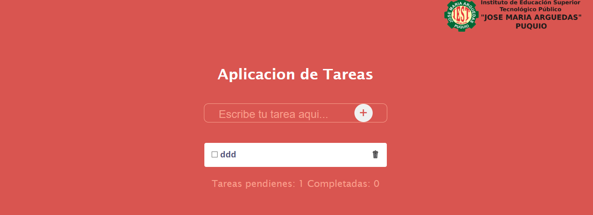

# 📝 App tareas

Una aplicación web sencilla e intuitiva para gestionar tus tareas diarias.
Permite añadir, marcar como completadas y eliminar tareas mediante una interfaz minimalista basada en tarjetas.

## 🚀 Características principales

- ➕ Agregar tareas: Escribe una acción o pendiente en el campo de entrada y añádela a la lista.
- ✅ Marcar como completada: Cada tarjeta incluye un checkbox para indicar que la tarea fue realizada.
- ❌ Eliminar tareas: Botón individual para eliminar cualquier tarea de la lista
- 💾 (Opcional) Persistencia local: Guarda tus tareas en el localStorage para no perderlas al recargar la página.
- 🎨 Diseño responsivo: Compatible con dispositivos móviles y pantallas de escritorio.

## 🧱 Estructura del proyecto
```
📦 to-do-list-app
├── 📁 src/
│   ├── 📄 index.html
│   ├── 📄 style.css
│   ├── 📄 script.js
│   └── (o componentes si usas React/Vue)
├── 📄 README.md
└── 📄 package.json
```

## ⚙️ Instalación y ejecución
Opción 1: Usando un servidor local (vanilla JS)
1. Clona este repositorio
```
git clone https://github.com/ruthcastillo7/app_tarea_intermedio.git
```
2. Entra al directorio
```
cd to-do-list-app
```
3. Abre el archivo index.html en tu navegador o usa una extensión tipo Live Server.

## 💡 Uso de la aplicación

1. Escribe una tarea en el campo de texto
2. Haz clic en “Añadir” o presiona Enter
3. La tarea aparecerá en una tarjeta con:
- Un checkbox para marcarla como completada.
- Un botón de eliminar para quitarla de la lista.
4. Disfruta de una lista limpia y organizada ✨

## 🧰 Tecnologías utilizadas

- HTML5 – estructura del proyecto
- CSS3 / Tailwind / Bootstrap – estilos y diseño responsivo
- JavaScript (ES6+) – lógica de interacción

## 📸 Vista previa
(Agrega una captura de pantalla o GIF mostrando la app en acción)


## 🧠 Mejoras futuras
- Filtrar tareas (todas / completadas / pendientes)
- Editar el texto de una tarea
- Integrar base de datos (Firebase, Supabase, etc.)
- Autenticación de usuario
- Animaciones y modo oscuro 🌙